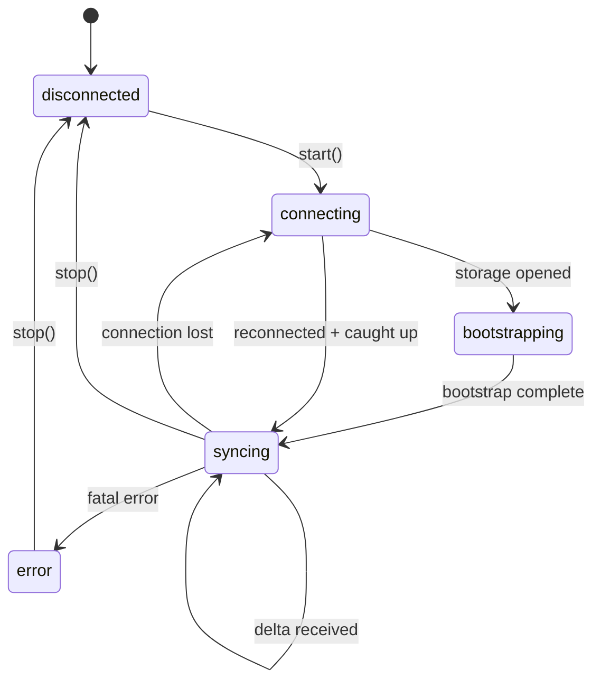

The server assigns a monotonically increasing `syncId` to every committed change, creating a single global ordering that all clients follow.

### Design lineage

Strata Sync is an open-source implementation of the sync engine Linear described but never released. The protocol below follows that architecture: a global `syncId`, bootstrap in three modes, partial indexes, a durable transaction queue, delta packets of sync actions, and sync groups as the permission boundary.

[Linear's sync engine, open-sourced](https://blode.co/stratasync/guides/linear-sync-engine) maps each part of Linear's published design onto the module that implements it, and lists what Strata Sync adds on top (Yjs collaboration, undo/redo, swappable adapters).

## The sync log

A monotonic append-only log of **sync actions**. Each action represents a single change to a single model row.

| Field       | Description                                                                                     |
| ----------- | ----------------------------------------------------------------------------------------------- |
| `syncId`    | A monotonically increasing integer assigned by the server, encoded as a **string** on the wire. |
| `modelName` | Which model changed (for example, `"Task"` or `"User"`).                                        |
| `modelId`   | The primary key of the affected row.                                                            |
| `action`    | The change type. See the action letters below.                                                  |
| `data`      | The changed fields (for inserts and updates) or `null` (for deletes).                           |
| `groupId`   | The sync group the row belongs to, when the model is group-scoped. Used for access control.     |

### Action letters

Five letters carry a row and are applied to it:

| Letter | Meaning   |
| ------ | --------- |
| `"I"`  | Insert    |
| `"U"`  | Update    |
| `"D"`  | Delete    |
| `"A"`  | Archive   |
| `"V"`  | Unarchive |

Three more carry no row. A client routes them rather than applying them, and a
client that rejects an unknown letter will fail the whole delta packet the first
time one arrives — so an implementation must accept all eight:

| Letter | Meaning                                                                                                                                      |
| ------ | -------------------------------------------------------------------------------------------------------------------------------------------- |
| `"C"`  | Covering. Grants the client coverage of a partial-index key without carrying the rows behind it; the client fetches them.                    |
| `"G"`  | Sync-group membership change. Addressed to the changed user's own group and carrying `{ subscribedSyncGroups }`; forces a full re-bootstrap. |
| `"S"`  | Handled exactly as `"G"` is. No server in this package emits it; it is accepted so a log that does carry it still applies.                   |

A **delta packet** bundles sync actions with a `lastSyncId` watermark:

```ts
interface DeltaPacket {
  /** Highest sync ID in this packet. */
  lastSyncId: SyncId;
  actions: SyncAction[];
  /** Set when the server has more deltas to send. */
  hasMore?: boolean;
}
```

`SyncId` is a `string`, not a `number`. The log outgrows `Number.MAX_SAFE_INTEGER`
in a busy workspace, and a JSON number would silently lose precision at that
point, so sync IDs are strings end to end and compared as big integers.

The client tracks its own `lastSyncId` and advances it after applying each delta packet. This is the only way confirmed state advances on the client.

## Client state machine

Five states: `"disconnected"`, `"connecting"`, `"bootstrapping"`, `"syncing"`, and `"error"`.



**Connecting** opens IndexedDB, reads `schemaHash` and `lastSyncId`, and decides on full or local bootstrap. **Bootstrapping** loads the initial dataset (see [Bootstrap modes](#bootstrap-modes)). **Syncing** applies delta packets, persists to IndexedDB, rebases pending transactions, and advances `lastSyncId`. **Error** captures fatal failures; call `stop()` to return to `disconnected`.

### Reconnecting and catch-up

On disconnect, the client retries with exponential backoff. After reconnecting, it fetches deltas after `lastSyncId` via the HTTP catch-up endpoint, transitions to `syncing`, and retries pending outbox transactions.

## Bootstrap modes

Set via `bootstrapMode` on `SyncClientOptions`.

| Mode      | Behavior                                                                                                    |
| --------- | ----------------------------------------------------------------------------------------------------------- |
| `"auto"`  | Full bootstrap if no local data exists; local bootstrap with delta catch-up otherwise. This is the default. |
| `"full"`  | Always performs a full bootstrap from the server, ignoring any local data.                                  |
| `"local"` | Bootstraps from local data only. Useful offline or when displaying cached data before connecting.           |

**Full bootstrap** streams NDJSON model rows from the server, writes to IndexedDB, hydrates the identity map, and sets `lastSyncId`. **Local bootstrap** reads from IndexedDB into the identity map, then fetches deltas from the stored `lastSyncId`.

## Model load strategies

Each model declares a load strategy that controls when it syncs.

| Strategy                | Description                                                                                                                            |
| ----------------------- | -------------------------------------------------------------------------------------------------------------------------------------- |
| `"instant"`             | Included in the initial bootstrap. The full dataset syncs eagerly. Best for small, frequently accessed models (users, teams, labels).  |
| `"lazy"`                | Not included in bootstrap. Loads from the server on first access via `ensureModel()` or `useModel()`. Cached locally after first load. |
| `"partial"`             | Loads by index values (for example, all comments for a specific task). The client tracks partial index coverage.                       |
| `"explicitlyRequested"` | Never loaded automatically. Fetched only when you explicitly request it.                                                               |
| `"local"`               | Client-only data that never syncs to the server. Useful for UI state or drafts.                                                        |

### Bootstrap completion

Successful full and partial bootstrap responses end with a terminal NDJSON record:

```json
{ "type": "end", "rowCount": 42 }
```

The server emits this record only after all requested models finish streaming,
including an empty snapshot (`rowCount: 0`). `rowCount` is the total number of
model rows actually emitted after touched-row filtering; it excludes metadata
and the terminal record. Metadata's `returnedModelsCount` contains pre-filter
counts and must not be used for exact completeness validation.

Deploy the server update before requiring this marker in clients. A client that
enforces completeness should require the terminal record and verify its count
before replacing its stored snapshot or advancing its cursor. EOF without the
marker is an incomplete bootstrap. Existing clients that ignore `end` records
remain compatible, but do not gain truncation protection until they enforce it.
Batch-load responses do not use this completion marker.

## Idempotency

Every mutation carries an idempotency key (`clientId + clientTxId`). The server deduplicates, so resending after a crash or network drop is safe.

```ts
{
  clientId: "c_abc123",      // Unique per browser/device, persisted in IndexedDB
  clientTxId: "tx_def456",   // Unique per transaction
}
```

## Schema hash and migrations

`computeSchemaHash()` produces a deterministic 16-character hex hash (a 64-bit stable hash) from all model definitions. If the stored hash doesn't match on startup, the client triggers a full re-bootstrap.

## Wire primitives

Three wire formats:

**Model row** (bootstrap and batch load):

```json
{ "__class": "Task", "id": "abc", "title": "Bug fix", "status": "open" }
```

**Sync action** (delta stream):

```json
{
  "syncId": "42",
  "modelName": "Task",
  "modelId": "abc",
  "action": "U",
  "data": { "status": "closed", "updatedAt": 1736899200000 },
  "groupId": "team_9f2",
  "clientId": "c_abc123",
  "clientTxId": "tx_def456"
}
```

`clientId` and `clientTxId` are echoed back so the originating client can
recognise its own write and suppress the redundant re-render.

**Mutation request** (outbox to server):

```json
{
  "batchId": "batch_7c1",
  "transactions": [
    {
      "action": "UPDATE",
      "clientId": "c_abc123",
      "clientTxId": "tx_def456",
      "modelName": "Task",
      "modelId": "abc",
      "payload": { "status": "closed" }
    }
  ]
}
```

On the wire an action is spelled out (`INSERT`, `UPDATE`, `DELETE`, `ARCHIVE`,
`UNARCHIVE`); the single letters in the table above are how the same action is
written back in the sync log. The changed fields go in `payload`. A batch
carries at most 100 transactions.

## Sync groups and partial replication

Sync groups control which data each client sees. Model rows belong to one or more groups (workspace IDs, team IDs, user IDs), and the server filters responses by the client's subscribed groups. See the [load strategies guide](/guides/load-strategies).
